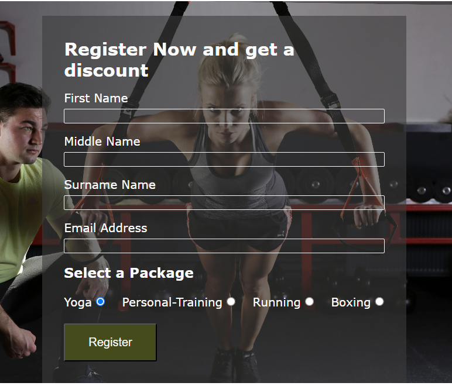

# Gym Exercise
Gym Exercise is a website that target people who has the desire to keep fit based on different reasons. Some of the reason include: training for competition like game, increase energy level, energize the bones and muscles, help in weight management, makes you feel good.

## Features
Gym Exercise is a responsive site with navigational bar with links to three pages: Home, Club-Photos and Register. 

### Home
Home navigation bar is the home page which comprises of gym image, training packages, time schedule and coach and the footer. 
#### Gym Image
•	This home page image will enable the users to be captivated by the first view they glance when opening the site. 

•	It make them to see a trainee and be motivated by it.

#### Training Packages
•	This area shows the different major packages offered and the advantages.
•	It encourages the user to desire to partake in gym exercise to keep fit and personal reasons.

#### Time Schedule and Coach
•	Time Schedule shows the different Packages and time available for training

•	Each training package has a coach assigned to it. 

#### Contact Us
•	This feature of the home page shows the different social media contact of the gym exercise.

•	The social media when clicked will open in a new page for easy navigation and helps the gym members to be connected to one another. 

### Club-Photos 
•	Club-Photos shows the users the images of different individuals doing different gym exercises to enable them make the right selection of the one to go for.

### Register
•	This page is a place the interested candidates can register to start up with gym exercises. 

## Features Left to Implement
•	An online section where an interested user anywhere in the world can register, pay and be trained through any online platform.

## Testing
•	I confirmed that the navigational bar, the home, club-photos and the register pages are readable and easy to understand.

•	I confirmed that the Gym Exercise site is responsive and looks good in standard different screen sizes.

•	The register form works very well. It requires entries in every field. In email label, it only accepts email address and the submit button works.

## Validator Testing
•	HTML

o	No error was returned when passing through official W3C Validator website.

•	CSS

o	Two errors was returned when passing through official (Jigsaw) Validator.

## Unfixed bugs
I could not fix the error because it is a column-count problem. The validator demands a unit should be added to the column count but column count which was added to the media queries has no unit.

## Accesibility
Gym exercise was accessed using lighthouse in devtools

## Deployment
•	The site was deployed to GitHub pages. The steps to deploy  are as follows:

o	In the GitHub repository, navigate to the Settings tab.

o	From the source section drop-down menu, select the Master Branch.

o	Once the master branch has been selected, the page provided the link to the completed website.

The live link can be found here - [Gym Exercise](https://chijioke100.github.io/gym/)

## Credits

### Contents
•	The icons in the footer was taken from [Font Awesome](https://fontawesome.com/)
•	The concept style of the structure of the work and the coding was taken from [Love Running](https://code-institute-org.github.io/love-running-2.0/index.html)

### Media
•	The images used for the home page, the club-photos page and the register page was taken from [Pexels](https://www.pexels.com) 

